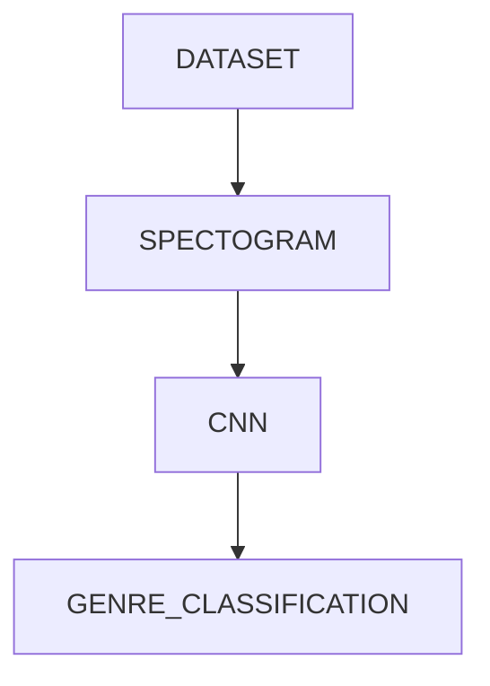

# MUSIC GENRE CLASSIFICATION

The main aim of the project is to identify the genre of the music clips.This is done using GTZAN dataset. With the help of PyTorch , Convolutional neural network is made of 3 convolutional and 4 linear layers . ReLu activation function and SGD optimizer with learning rate =0.0005 is used .

**BASIC FLOW :**

For the input the spectograms were generated which were then passed to the convolutional neural network and with the help of genre as labels the classification was done.

**Genres:**

- Blues

- Classical

- Country

* Disco

* Hiphop

* Jazz

* Metal

* Pop

* Reggae

* Rock

## Accuracy 

Train set : 93.75%

Test set : 67.67 %

Accuracy plot :

Loss plot :

